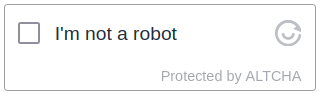

# TAHFA (Terraform AWS HTML Form Action)

TAHFA implements a simple form handler for plain html forms. Great for static
websites. Sets up Lambda and API Gateway.

[](https://www.technative.nl)

## Features

- Creates Lambda mailform POST endpoint
- Optional Success URL redirect
- Optional Failure URL redirect
- Optional [ALTCHA](https://altcha.org) Spam Protection
- Optional Mail reply template

## How does it work

The TAHFA module creates an API Gateway POST resource and connects this to a
lambda function. When a HTML form is submitted the API Gateway forwards the
formdata to the lambda function and this sends the email.

## Altcha Implementation



Since version 0.2 TAHFA features [ALTCHA](https://altcha.org) challege and validation funcions.
ALTCHA is a free, open-source CAPTCHA alternative. ALTCHA uses a proof-of-work
mechanism to protect your website, APIs, and online services from spam and
unwanted content. ALTCHA is free, open-source, does not use cookies nor
fingerprinting, does not track users, and is fully compliant with GDPR.

## Requirements

- A configured SES domain or SES emails available in the same account.

## Example

Checkout the [examples](./examples) for complete implementations. The inline example below
shows a simple usa case.

### terraform

```hcl
module "form_action_example_com" {
  source         = "TechNative-B-V/html-form-action/aws"

  name           = "example-com-form-action-handler"
  to_email       = "webinbox@example.com"
  from_email     = "no-reply@example.com"
}

output "form_action_example_com_url_for_form" {
  description = "Place this URL in your the action attribute of your form element."
  value = module.form_action_example_com.message_post_url
}
```

### Simple html form

The form html looks like this.

```html
<form action="https://XXXXXXXXXX.execute-api.eu-central-1.amazonaws.com/formpost/message" method="post">

  <!-- FORM CONFIGURATION -->
  <input type="hidden" name="_subject" value="Demo Form Submission">
  <input type="hidden" name="_success_url" value="http://example.com/form_success.html">

  <!-- FORM FIELDS -->
  <input placeholder="Full Name" type="text" name="full-name"><br>
  <input placeholder="Email" type="text" name="Email"><br>
  <textarea name="message" placeholder="Your message"></textarea><br>

  <input type="submit" value="send"></br>

</form>
```

<!-- BEGIN_TF_DOCS -->
## Providers

| Name | Version |
|------|---------|
| <a name="provider_aws"></a> [aws](#provider\_aws) | >= 4.0.0 |

## Modules

| Name | Source | Version |
|------|--------|---------|
| <a name="module_lambda_function_altchachallenge"></a> [lambda\_function\_altchachallenge](#module\_lambda\_function\_altchachallenge) | terraform-aws-modules/lambda/aws | 3.3.1 |
| <a name="module_lambda_function_formpost"></a> [lambda\_function\_formpost](#module\_lambda\_function\_formpost) | terraform-aws-modules/lambda/aws | 3.3.1 |
| <a name="module_resource_cors_altchachallenge"></a> [resource\_cors\_altchachallenge](#module\_resource\_cors\_altchachallenge) | mewa/apigateway-cors/aws | 2.0.0 |
| <a name="module_resource_cors_formpost"></a> [resource\_cors\_formpost](#module\_resource\_cors\_formpost) | mewa/apigateway-cors/aws | 2.0.0 |

## Resources

| Name | Type |
|------|------|
| [aws_api_gateway_deployment.altcha_challenge](https://registry.terraform.io/providers/hashicorp/aws/latest/docs/resources/api_gateway_deployment) | resource |
| [aws_api_gateway_deployment.formpost](https://registry.terraform.io/providers/hashicorp/aws/latest/docs/resources/api_gateway_deployment) | resource |
| [aws_api_gateway_integration.message_altchachallenge](https://registry.terraform.io/providers/hashicorp/aws/latest/docs/resources/api_gateway_integration) | resource |
| [aws_api_gateway_integration.message_formpost](https://registry.terraform.io/providers/hashicorp/aws/latest/docs/resources/api_gateway_integration) | resource |
| [aws_api_gateway_method.message_altchachallenge](https://registry.terraform.io/providers/hashicorp/aws/latest/docs/resources/api_gateway_method) | resource |
| [aws_api_gateway_method.message_formpost](https://registry.terraform.io/providers/hashicorp/aws/latest/docs/resources/api_gateway_method) | resource |
| [aws_api_gateway_resource.message_altchachallenge](https://registry.terraform.io/providers/hashicorp/aws/latest/docs/resources/api_gateway_resource) | resource |
| [aws_api_gateway_resource.message_formpost](https://registry.terraform.io/providers/hashicorp/aws/latest/docs/resources/api_gateway_resource) | resource |
| [aws_api_gateway_rest_api.altcha_challenge](https://registry.terraform.io/providers/hashicorp/aws/latest/docs/resources/api_gateway_rest_api) | resource |
| [aws_api_gateway_rest_api.formpost](https://registry.terraform.io/providers/hashicorp/aws/latest/docs/resources/api_gateway_rest_api) | resource |
| [aws_lambda_permission.lambda_permission](https://registry.terraform.io/providers/hashicorp/aws/latest/docs/resources/lambda_permission) | resource |
| [aws_lambda_permission.lambda_permission_formpost](https://registry.terraform.io/providers/hashicorp/aws/latest/docs/resources/lambda_permission) | resource |

## Inputs

| Name | Description | Type | Default | Required |
|------|-------------|------|---------|:--------:|
| <a name="input_allowed_origin"></a> [allowed\_origin](#input\_allowed\_origin) | Which origin to allow submissions from. Use * when testing | `string` | `"*"` | no |
| <a name="input_altcha_hmac_key"></a> [altcha\_hmac\_key](#input\_altcha\_hmac\_key) | HMAC Key to sign and validate Altcha Challenge | `string` | `"change.me.now"` | no |
| <a name="input_from_email"></a> [from\_email](#input\_from\_email) | Receiving email address for forwarded messages, can also be configured in html form | `string` | `""` | no |
| <a name="input_name"></a> [name](#input\_name) | Name to use for function and api gateway | `string` | n/a | yes |
| <a name="input_to_email"></a> [to\_email](#input\_to\_email) | 'From' email to use when forwarding a message, defaults to recipient email in the Lambda, can also be configured in html form | `string` | `""` | no |
| <a name="input_use_altcha"></a> [use\_altcha](#input\_use\_altcha) | Enable Altcha Spam protection | `bool` | n/a | yes |

## Outputs

| Name | Description |
|------|-------------|
| <a name="output_message_altcha_challenge_url"></a> [message\_altcha\_challenge\_url](#output\_message\_altcha\_challenge\_url) | GET URL for Altcha Challenge requests |
| <a name="output_message_post_url"></a> [message\_post\_url](#output\_message\_post\_url) | POST URL for message requests |
<!-- END_TF_DOCS -->
